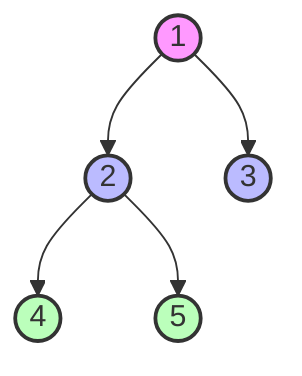
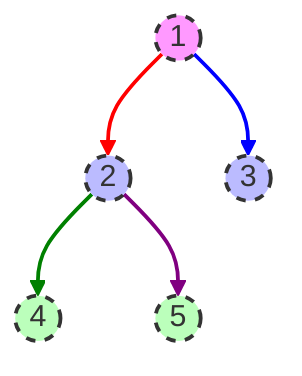
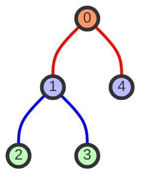
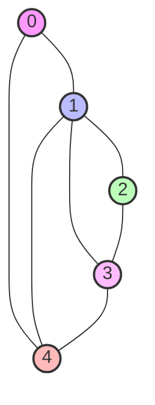
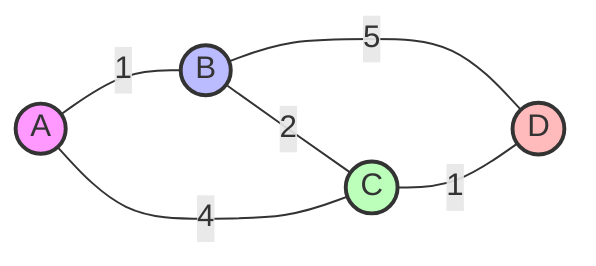
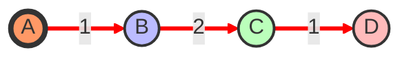

# Árboles y grafos: estructuras y recorridos

## Introducción

Los árboles y grafos son estructuras de datos fundamentales en ciencias de la computación. Mientras los árboles representan datos jerárquicos con un único camino entre dos nodos cualesquiera, los grafos permiten modelar relaciones más complejas entre entidades, posiblemente con múltiples caminos entre nodos.

En este apunte, estudiaremos las implementaciones de estas estructuras en Python y los diferentes algoritmos para recorrerlas.

## Árboles

### Árboles Binarios

Un árbol binario es una estructura donde cada nodo tiene como máximo dos hijos, normalmente denominados hijo izquierdo e hijo derecho.

```python
class Nodo:
    def __init__(self, valor):
        self.valor = valor
        self.izquierda = None
        self.derecha = None
```

Ejemplo de creación de un árbol binario:

```python
# Crear un árbol binario
raiz = Nodo(1)
raiz.izquierda = Nodo(2)
raiz.derecha = Nodo(3)
raiz.izquierda.izquierda = Nodo(4)
raiz.izquierda.derecha = Nodo(5)
```

Representación visual del árbol binario:



### Recorridos en Árboles

#### Recorrido en Preorden

En el recorrido en preorden, visitamos primero la raíz, luego el subárbol izquierdo y finalmente el subárbol derecho.

```python
def preorden(nodo):
    if nodo:
        print(nodo.valor, end=' ')  # Visitar nodo actual
        preorden(nodo.izquierda)    # Recorrer subárbol izquierdo
        preorden(nodo.derecha)      # Recorrer subárbol derecho

# Uso
print("Recorrido en Preorden:")
preorden(raiz)  # Salida: 1 2 4 5 3
```

Visualización del recorrido preorden:



Orden de visita: 1 → 2 → 4 → 5 → 3

#### Recorrido en Inorden

En el recorrido en inorden, visitamos primero el subárbol izquierdo, luego la raíz y finalmente el subárbol derecho.

```python
def inorden(nodo):
    if nodo:
        inorden(nodo.izquierda)     # Recorrer subárbol izquierdo
        print(nodo.valor, end=' ')  # Visitar nodo actual
        inorden(nodo.derecha)       # Recorrer subárbol derecho

# Uso
print("\nRecorrido en Inorden:")
inorden(raiz)  # Salida: 4 2 5 1 3
```

Visualización del recorrido inorden:


Orden de visita: 4 → 2 → 5 → 1 → 3

#### Recorrido en Postorden

En el recorrido en postorden, visitamos primero el subárbol izquierdo, luego el subárbol derecho y finalmente la raíz.

```python
def postorden(nodo):
    if nodo:
        postorden(nodo.izquierda)   # Recorrer subárbol izquierdo
        postorden(nodo.derecha)     # Recorrer subárbol derecho
        print(nodo.valor, end=' ')  # Visitar nodo actual

# Uso
print("\nRecorrido en Postorden:")
postorden(raiz)  # Salida: 4 5 2 3 1
```

#### Recorrido por niveles (o a lo ancho) (BFS) 

En el recorrido por niveles (Breadth-First Search o BFS), visitamos todos los nodos de un nivel antes de pasar al siguiente nivel.

```python
from collections import deque

def recorrido_por_niveles(raiz):
    if not raiz:
        return
    
    cola = deque([raiz])
    
    while cola:
        nodo = cola.popleft()
        print(nodo.valor, end=' ')
        
        if nodo.izquierda:
            cola.append(nodo.izquierda)
        if nodo.derecha:
            cola.append(nodo.derecha)

# Uso
print("\nRecorrido por Niveles:")
recorrido_por_niveles(raiz)  # Salida: 1 2 3 4 5
```
Visualización del recorrido BFS desde el vértice 0:



La visualización muestra los niveles de exploración:
- Nivel 0: Nodo 0 (rojo)
- Nivel 1: Nodos 1 y 4 (azul)
- Nivel 2: Nodos 2 y 3 (verde)

## Grafos

### Representación de Grafos
Visualización del grafo de ejemplo:


Abajo veremos dos formas de representar grafos: con una matriz de adyacencia y con listas de adyacencia.

#### Matriz de Adyacencia

La matriz de adyacencia es una matriz cuadrada donde cada elemento indica si hay una arista entre los vértices correspondientes.

**Representación visual de la matriz de adyacencia:**

```
   | 0 1 2 3 4
---+-----------
 0 | 0 1 0 0 1
 1 | 1 0 1 1 1
 2 | 0 1 0 1 0
 3 | 0 1 1 0 1
 4 | 1 1 0 1 0
```

Donde un 1 en la posición [i][j] indica que hay una arista desde el vértice i hasta el vértice j, y un 0 indica que no hay arista.

```python
import numpy as np

class GrafoMatriz:
    def __init__(self, num_vertices):
        self.V = num_vertices
        self.grafo = np.zeros((num_vertices, num_vertices), dtype=int)
        
    def agregar_arista(self, origen, destino):
        # Para grafos no dirigidos
        self.grafo[origen][destino] = 1
        self.grafo[destino][origen] = 1
        
    def mostrar_matriz(self):
        print("Matriz de adyacencia:")
        print(self.grafo)

# Ejemplo de uso
g_matriz = GrafoMatriz(5)
g_matriz.agregar_arista(0, 1)
g_matriz.agregar_arista(0, 4)
g_matriz.agregar_arista(1, 2)
g_matriz.agregar_arista(1, 3)
g_matriz.agregar_arista(1, 4)
g_matriz.agregar_arista(2, 3)
g_matriz.agregar_arista(3, 4)

g_matriz.mostrar_matriz()

# El resultado sería:
# Matriz de adyacencia:
# [[0 1 0 0 1]
#  [1 0 1 1 1]
#  [0 1 0 1 0]
#  [0 1 1 0 1]
#  [1 1 0 1 0]]

```

#### Lista de Adyacencia

La lista de adyacencia es una colección de listas no ordenadas, donde cada lista describe los vecinos de un vértice en el grafo. Esta representación es particularmente eficiente para grafos dispersos (pocos enlaces entre vértices).

**Representación conceptual usando una lista de adyacencia:**

```
Vértice | Lista de Vecinos
--------|----------------
   0    | 1, 4
   1    | 0, 2, 3, 4
   2    | 1, 3
   3    | 1, 2, 4
   4    | 0, 1, 3
```

Cada vértice tiene una lista asociada que contiene todos los vértices adyacentes a él.

##### Implementación Básica

```python
class Grafo:
    def __init__(self):
        self.lista_adyacencia = {}
        
    def agregar_vertice(self, vertice):
        if vertice not in self.lista_adyacencia:
            self.lista_adyacencia[vertice] = []
            
    def agregar_arista(self, origen, destino):
        # Para grafos no dirigidos
        self.lista_adyacencia[origen].append(destino)
        self.lista_adyacencia[destino].append(origen)
        
    def mostrar_lista_adyacencia(self):
        for vertice in self.lista_adyacencia:
            print(f"{vertice} -> {' '.join(map(str, self.lista_adyacencia[vertice]))}")

# Ejemplo de uso
g = Grafo()
for i in range(5):
    g.agregar_vertice(i)
    
g.agregar_arista(0, 1)
g.agregar_arista(0, 4)
g.agregar_arista(1, 2)
g.agregar_arista(1, 3)
g.agregar_arista(1, 4)
g.agregar_arista(2, 3)
g.agregar_arista(3, 4)

print("Lista de adyacencia del grafo:")
g.mostrar_lista_adyacencia()

# El resultado sería:
# 0 -> 1 4
# 1 -> 0 2 3 4
# 2 -> 1 3
# 3 -> 1 2 4
# 4 -> 0 1 3
```

### Recorridos en Grafos

#### Búsqueda en Profundidad (DFS)

La búsqueda en profundidad (Depth-First Search o DFS) explora el grafo yendo lo más profundo posible antes de retroceder. Para esto se usa una lista de "nodos vistados", la cuál sirve para no recorrero dos veces un mismo nodo.

```python
def dfs(grafo, inicio, visitados=None):
    if visitados is None:
        visitados = set()
    
    visitados.add(inicio)
    print(inicio, end=' ')
    
    for vecino in grafo.lista_adyacencia[inicio]:
        if vecino not in visitados:
            dfs(grafo, vecino, visitados)

# Uso
print("\nRecorrido DFS (empezando desde el vértice 0):")
dfs(g, 0)  # La salida depende del orden de los vecinos, por ejemplo: 0 1 2 3 4
```

Visualización del recorrido DFS desde el vértice 0:


La visualización muestra el camino de exploración: 0 → 1 → 2 → 3 → 4

**Implementación iterativa de DFS usando una pila:**

```python
def dfs_iterativo(grafo, inicio):
    visitados = set()
    pila = [inicio]
    
    while pila:
        vertice = pila.pop()
        
        if vertice not in visitados:
            visitados.add(vertice)
            print(vertice, end=' ')
            
            # Agregar vecinos no visitados a la pila
            for vecino in reversed(grafo.lista_adyacencia[vertice]):
                if vecino not in visitados:
                    pila.append(vecino)

# Uso
print("\nRecorrido DFS Iterativo (empezando desde el vértice 0):")
dfs_iterativo(g, 0)
```

## Árboles de Búsqueda Binaria (BST)

Los árboles de búsqueda binaria son árboles especiales donde los valores menores que la raíz se encuentran en el subárbol izquierdo, y los mayores en el derecho.

```python
class NodoBST:
    def __init__(self, valor):
        self.valor = valor
        self.izquierda = None
        self.derecha = None

def insertar_bst(raiz, valor):
    if raiz is None:
        return NodoBST(valor)
    
    if valor < raiz.valor:
        raiz.izquierda = insertar_bst(raiz.izquierda, valor)
    else:
        raiz.derecha = insertar_bst(raiz.derecha, valor)
    
    return raiz

def buscar_bst(raiz, valor):
    if raiz is None or raiz.valor == valor:
        return raiz
    
    if valor < raiz.valor:
        return buscar_bst(raiz.izquierda, valor)
    else:
        return buscar_bst(raiz.derecha, valor)

# Ejemplo de uso
bst = None
valores = [50, 30, 70, 20, 40, 60, 80]

for valor in valores:
    bst = insertar_bst(bst, valor)

print("\nInorden del BST (debería estar ordenado):")
inorden(bst)  # Salida: 20 30 40 50 60 70 80
```

## Algoritmo de Dijkstra (Camino más Corto)

El algoritmo de Dijkstra encuentra el camino más corto desde un vértice a todos los demás en un grafo ponderado. Un grafo ponderado es un grafo cuyas aristas tienen un *peso* o valor (numérico) de ponderación. El peso representa la distancia entre los nodos que une esa arista.
**Visualización del grafo ponderado:**



**Visualización de los caminos más cortos desde A:**



**Distancias más cortas desde A:**

- A→A: 0
- A→B: 1
- A→C: 3 (A→B→C)
- A→D: 4 (A→B→C→D)

```python
import heapq

def dijkstra(grafo, inicio):
    # Inicializar distancias con infinito
    distancias = {vertice: float('infinity') for vertice in grafo}
    distancias[inicio] = 0
    pq = [(0, inicio)]
    
    while pq:
        dist_actual, vertice_actual = heapq.heappop(pq)
        
        # Si encontramos una distancia mayor, ignoramos
        if dist_actual > distancias[vertice_actual]:
            continue
            
        for vecino, peso in grafo[vertice_actual].items():
            distancia = dist_actual + peso
            
            # Si encontramos un camino más corto
            if distancia < distancias[vecino]:
                distancias[vecino] = distancia
                heapq.heappush(pq, (distancia, vecino))
    
    return distancias

# Ejemplo de uso
grafo_ponderado = {
    'A': {'B': 1, 'C': 4},
    'B': {'A': 1, 'C': 2, 'D': 5},
    'C': {'A': 4, 'B': 2, 'D': 1},
    'D': {'B': 5, 'C': 1}
}

print("\nDistancias más cortas desde A:")
print(dijkstra(grafo_ponderado, 'A'))
```

## Ejercicios Propuestos

1. Implementar un árbol AVL (árbol binario de búsqueda balanceado).
2. Escribir una función para determinar si un grafo es conexo.
3. Implementar el algoritmo de Kruskal para encontrar el árbol de expansión mínima.
4. Implementar una función para detectar ciclos en un grafo no dirigido.
5. Escribir un algoritmo para encontrar todos los componentes fuertemente conectados en un grafo dirigido (algoritmo de Kosaraju).

