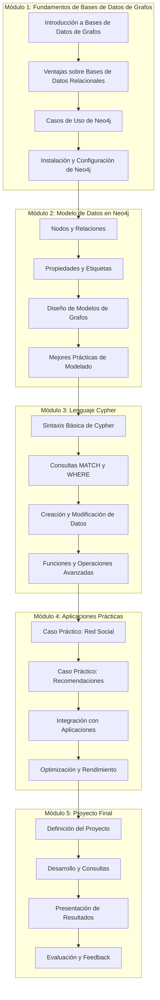

# Diagrama de Curso Corto de Neo4j

## Desglose Detallado del Curso

### Módulo 1: Fundamentos de Bases de Datos de Grafos (3 horas)
- **Introducción a Bases de Datos de Grafos**: Conceptos básicos, historia y evolución
- **Ventajas sobre Bases de Datos Relacionales**: Comparativa y escenarios óptimos
- **Casos de Uso de Neo4j**: Análisis de redes, detección de fraude, recomendaciones, etc.
- **Instalación y Configuración**: Configuración de Neo4j Desktop y Neo4j Browser

### Módulo 2: Modelo de Datos en Neo4j (4 horas)
- **Nodos y Relaciones**: Estructura fundamental de la base de datos de grafos
- **Propiedades y Etiquetas**: Metadatos y clasificación de elementos
- **Diseño de Modelos de Grafos**: Transformación de problemas a modelos de grafos
- **Mejores Prácticas**: Patrones de diseño y antipatrones

### Módulo 3: Lenguaje Cypher (5 horas)
- **Sintaxis Básica**: Estructura y componentes del lenguaje Cypher
- **Consultas MATCH y WHERE**: Recuperación de datos con condiciones
- **Creación y Modificación**: CREATE, MERGE, SET, DELETE y otros comandos
- **Funciones Avanzadas**: Agregación, ordenamiento, proyección y caminos

### Módulo 4: Aplicaciones Prácticas (4 horas)
- **Caso Práctico: Red Social**: Modelado y consultas para redes sociales
- **Caso Práctico: Sistema de Recomendaciones**: Algoritmos y patrones
- **Integración con Aplicaciones**: Drivers para diferentes lenguajes (Python, Java, JavaScript)
- **Optimización y Rendimiento**: Índices, estrategias de consulta y monitoreo

### Módulo 5: Proyecto Final (4 horas)
- **Definición del Proyecto**: Selección de problema y alcance
- **Desarrollo y Consultas**: Implementación del modelo y consultas
- **Presentación de Resultados**: Visualización y exposición
- **Evaluación y Feedback**: Análisis de resultados y mejoras

## Recursos Adicionales

- **Neo4j Sandbox**: Entorno online para practicar sin instalación
- **Biblioteca de Grafos**: Modelos pre-construidos para diferentes casos de uso
- **Comunidad Neo4j**: Foros y recursos online para resolver dudas
- **Certificación Neo4j**: Información sobre certificaciones oficiales

