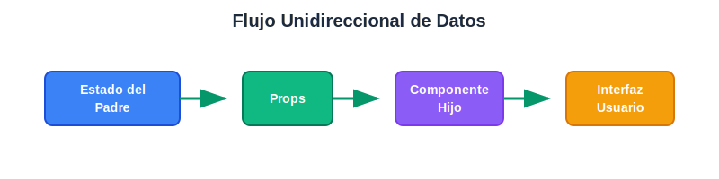

# Introducción a React: Arquitectura y Compilación
## ¿Qué es React?

React es una **biblioteca de JavaScript** creada por Facebook que revoluciona la forma en que construimos interfaces de usuario web. Más que una simple herramienta, React introduce un **paradigma arquitectónico** completo que cambia fundamentalmente cómo pensamos sobre el desarrollo frontend.

## El Cambio de Paradigma

### Arquitectura Tradicional (Imperativa)
En el desarrollo web tradicional, trabajamos de forma **imperativa**: le decimos al navegador exactamente **cómo** hacer cada cosa, paso a paso.

```javascript
// Enfoque tradicional: "Cómo hacer"
const button = document.createElement('button');
button.innerText = 'Incrementar';
button.addEventListener('click', () => {
  const counter = document.getElementById('counter');
  const currentValue = parseInt(counter.innerText);
  counter.innerText = currentValue + 1;
});
document.body.appendChild(button);
```

### Arquitectura React (Declarativa)
React nos permite trabajar de forma **declarativa**: describimos **qué** queremos que se muestre en cada momento, y React se encarga del **cómo**.

```jsx
// Enfoque React: "Qué queremos"
function Counter() {
  const [count, setCount] = useState(0);
  
  return (
    <div>
      <p>{count}</p>
      <button onClick={() => setCount(count + 1)}>
        Incrementar
      </button>
    </div>
  );
}
```

## Pilares Arquitectónicos de React

### 1. **Arquitectura Basada en Componentes**
React organiza la UI como un **árbol de componentes reutilizables**. Cada componente es una pieza independiente que encapsula su lógica y presentación.

```
App
├── Header
│   ├── Logo
│   └── Navigation
├── Main
│   ├── ProductList
│   │   └── ProductCard (x múltiples)
│   └── ShoppingCart
└── Footer
```

### 2. **Flujo Unidireccional de Datos**
Los datos fluyen en una sola dirección: **de padres a hijos** a través de props, lo que hace el estado predecible y fácil de debuggear.




### 3. **Virtual DOM y Reconciliación**
React mantiene una representación virtual del DOM en memoria y solo actualiza las partes que realmente cambiaron, optimizando el rendimiento automáticamente.

## Ventajas Arquitectónicas

✅ **Mantenibilidad**: Código más organizado y fácil de mantener  
✅ **Reutilización**: Componentes que se pueden usar en múltiples lugares  
✅ **Escalabilidad**: Arquitectura que crece bien con equipos grandes  
✅ **Testabilidad**: Componentes aislados son más fáciles de probar  
✅ **Desarrollo Colaborativo**: Diferentes desarrolladores pueden trabajar en componentes independientes

## React vs Otras Arquitecturas

| Aspecto | Arquitectura Tradicional | React |
|---------|-------------------------|-------|
| **Paradigma** | Imperativo (cómo) | Declarativo (qué) |
| **Organización** | Archivos por tipo | Componentes por funcionalidad |
| **Estado** | Global/esparcido | Encapsulado en componentes |
| **Reutilización** | Copy-paste | Componentes reutilizables |
| **Debugging** | Difícil rastrear cambios | Estado predecible |

---

## JSX no es JavaScript Puro

Aquí surge una diferencia fundamental: **React introduce JSX**, que no es JavaScript puro que el navegador pueda ejecutar directamente.

Cuando escribimos React, usamos **JSX** (JavaScript XML):

```jsx
// Esto NO es JavaScript válido para el navegador
function Welcome() {
  return <h1>Hola mundo</h1>;
}
```

El navegador no entiende esta sintaxis. Si intentas ejecutar este código directamente, obtendrás un error de sintaxis.

## La Solución: Proceso de Transformación

React requiere un **paso de compilación** que transforma JSX en JavaScript puro:

### 1. **Código que escribimos (JSX)**
```jsx
function Welcome({ name }) {
  return (
    <div className="greeting">
      <h1>Hola, {name}!</h1>
      <p>Bienvenido a React</p>
    </div>
  );
}
```

### 2. **Código transformado (JavaScript puro)**
```javascript
function Welcome({ name }) {
  return React.createElement(
    'div',
    { className: 'greeting' },
    React.createElement('h1', null, `Hola, ${name}!`),
    React.createElement('p', null, 'Bienvenido a React')
  );
}
```

### 3. **El navegador ejecuta el JavaScript transformado**

## Herramientas de Transformación

### **Babel** - El Compilador Principal
Babel es quien se encarga de la transformación JSX → JavaScript:

```javascript
// babel.config.js
{
  "presets": ["@babel/preset-react"]
}
```

### **Create React App** - Todo Configurado
Cuando usas `create-react-app`, incluye automáticamente:

- ✅ Babel configurado
- ✅ Webpack para empaquetar
- ✅ Servidor de desarrollo
- ✅ Hot reloading

```bash
npx create-react-app mi-app
cd mi-app
npm start  # ← Aquí sucede la magia de transformación
```

## El Flujo Completo


## ¿Por qué usar JSX si complica las cosas?

### **Sin JSX** (JavaScript puro)
```javascript
// Difícil de leer y mantener
return React.createElement(
  'div',
  { className: 'user-card' },
  React.createElement('h2', null, user.name),
  React.createElement('p', null, user.email),
  React.createElement(
    'button',
    { onClick: handleClick },
    'Contactar'
  )
);
```

### **Con JSX** (Mucho más legible)
```jsx
// Familiar, legible, mantenible
return (
  <div className="user-card">
    <h2>{user.name}</h2>
    <p>{user.email}</p>
    <button onClick={handleClick}>Contactar</button>
  </div>
);
```

## Alternativas Modernas

### **Vite** - Compilación Más Rápida
```bash
npm create vite@latest mi-app -- --template react
```

### **Next.js** - Framework con Compilación Incluida
```bash
npx create-next-app@latest mi-app
```

## Resumen: React como Arquitectura Completa

**React necesita compilación porque:**

- ❌ JSX no es JavaScript válido
- ❌ Los navegadores no entienden `<div>` dentro de JavaScript
- ✅ JSX es mucho más legible que `React.createElement()`
- ✅ Las herramientas modernas hacen la compilación transparente

**React no es solo una herramienta más:** es una **filosofía de arquitectura** que:

- Cambia cómo pensamos sobre las interfaces (declarativo vs imperativo)
- Requiere un paso de compilación (JSX → JavaScript)
- Nos ayuda a construir aplicaciones más robustas, mantenibles y escalables

Aunque añade complejidad inicial con la compilación, React hace que escribir y mantener interfaces sea mucho más intuitivo y poderoso a largo plazo.

---

## Ejemplo Práctico: Tu Primera App React

### Paso 1: Crear el Proyecto
```bash
npx create-react-app mi-primera-app
cd mi-primera-app
```

### Paso 2: Reemplazar el Contenido de `src/App.js`
```jsx
function App() {
  return (
    <div>
      <h1>Mi Tienda Online</h1>
      <div>
        <h3>iPhone 15</h3>
        <p>Precio: $999</p>
        <button>Agregar al carrito</button>
      </div>
      <div>
        <h3>MacBook Pro</h3>
        <p>Precio: $1999</p>
        <button>Agregar al carrito</button>
      </div>
    </div>
  );
}

export default App;
```

### Paso 3: Ejecutar la Aplicación
```bash
npm start
```

### Paso 4: Ver el Resultado
- Se abre automáticamente en `http://localhost:3000`
- Verás tu tienda online con productos y botones

### Paso 5: Ver la Magia de la Compilación
En las herramientas de desarrollador del navegador, ve a la pestaña "Sources" y busca el archivo compilado. Verás que tu JSX se transformó en algo como:

```javascript
React.createElement("div", null,
  React.createElement("h1", null, "Mi Tienda Online"),
  React.createElement("div", null,
    React.createElement("h3", null, "iPhone 15"),
    React.createElement("p", null, "Precio: $999"),
    React.createElement("button", null, "Agregar al carrito")
  ),
  // ... más código transformado
);
```

### ¡Listo!
Tienes tu primera aplicación React funcionando. El navegador está ejecutando JavaScript puro, pero tú escribiste JSX. React y sus herramientas se encargaron de toda la transformación automáticamente.
