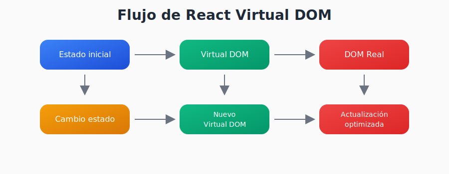

# Parte 1: Fundamentos de React y Comparación con Desarrollo Tradicional

## ⚙️ Configuración del Entorno

### Requisitos Previos

- **Node.js** (v14 o superior) - [Descargar aquí](https://nodejs.org/)
- **Editor de código** (VS Code recomendado)
- **Terminal/Línea de comandos**

### Verificar Instalación

```bash
node -v    # Debería mostrar la versión de Node.js
npm -v     # Debería mostrar la versión de npm
```

### Crear Proyecto React

```bash
# Crear nuevo proyecto
npx create-react-app mi-aplicacion

# Navegar al directorio
cd mi-aplicacion

# Iniciar servidor de desarrollo
npm start
```

### Estructura del Proyecto

```
mi-aplicacion/
├── public/                 # Archivos públicos
│   ├── index.html         # HTML base
│   └── favicon.ico        # Icono del sitio
├── src/                   # Código fuente
│   ├── App.js            # Componente principal
│   ├── App.css           # Estilos del componente principal
│   ├── index.js          # Punto de entrada
│   └── index.css         # Estilos globales
├── package.json          # Dependencias y scripts
└── README.md            # Documentación
```

### Comandos Importantes

```bash
npm start          # Servidor de desarrollo (http://localhost:3000)
npm run build      # Crear versión de producción
npm test           # Ejecutar pruebas
npm install [pkg]  # Instalar dependencia
```

### Estructura Recomendada para Proyectos Reales

```
src/
├── components/           # Componentes reutilizables
│   ├── common/          # Botones, inputs, etc.
│   ├── layout/          # Header, Footer, etc.
│   └── features/        # Componentes específicos
├── pages/               # Páginas/rutas
├── services/            # Servicios para APIs
├── utils/               # Funciones utilitarias
├── hooks/               # Custom hooks
└── assets/              # Imágenes, fuentes, etc.
```

---

## 📝 JSX en Profundidad

### ¿Qué es JSX?

JSX es una **extensión de sintaxis para JavaScript** que permite escribir elementos que parecen HTML dentro del código JavaScript.

```jsx
// Esto es JSX
const element = <h1>Hola mundo!</h1>;

// Se transforma en esto:
const element = React.createElement('h1', null, 'Hola mundo!');
```

### Reglas Fundamentales de JSX

1. **Un solo elemento padre**
```jsx
// ❌ Incorrecto
return (
  <h1>Título</h1>
  <p>Párrafo</p>
);

// ✅ Correcto
return (
  <div>
    <h1>Título</h1>
    <p>Párrafo</p>
  </div>
);

// ✅ También correcto (Fragmentos)
return (
  <>
    <h1>Título</h1>
    <p>Párrafo</p>
  </>
);
```

2. **Cerrar todas las etiquetas**
```jsx
// ❌ Incorrecto en JSX

<input type="text">

// ✅ Correcto en JSX

<input type="text" />
```

3. **className en lugar de class**
```jsx
// ❌ Incorrecto
<div class="container">Contenido</div>

// ✅ Correcto
<div className="container">Contenido</div>
```

### Expresiones en JSX

Cualquier expresión JavaScript válida puede ir entre `{}`

```jsx
const name = 'Juan';
const age = 25;
const user = { firstName: 'Ana', lastName: 'García' };

function formatName(user) {
  return `${user.firstName} ${user.lastName}`;
}

return (
  <div>
    <h1>Hola, {name}</h1>
    <p>Tienes {age} años</p>
    <p>Resultado: {2 + 2}</p>
    <p>Nombre completo: {formatName(user)}</p>
    <p>Fecha actual: {new Date().toLocaleDateString()}</p>
  </div>
);
```

### Renderizado Condicional

**Operador Ternario:**
```jsx
{isLoggedIn ? (
  <h1>Bienvenido de vuelta!</h1>
) : (
  <h1>Por favor, inicia sesión</h1>
)}
```

**Operador Lógico &&:**
```jsx
{isLoggedIn && <h1>Estás conectado</h1>}
{errors.length > 0 && <div className="errors">Hay errores</div>}
```

**Función que retorna JSX:**
```jsx
function getWelcomeMessage(user) {
  if (user) {
    return <h1>Bienvenido, {user.name}!</h1>;
  }
  return <h1>Bienvenido, invitado!</h1>;
}

// En el componente
return (
  <div>
    {getWelcomeMessage(currentUser)}
  </div>
);
```

### Renderizado de Listas

```jsx
const fruits = ['manzana', 'banana', 'naranja'];

return (
  <ul>
    {fruits.map((fruit, index) => (
      <li key={index}>{fruit}</li>
    ))}
  </ul>
);
```

**⚠️ Importante:** Siempre usar la prop `key` con un valor único para cada elemento de la lista.

```jsx
const users = [
  { id: 1, name: 'Juan' },
  { id: 2, name: 'Ana' },
  { id: 3, name: 'Pedro' }
];

return (
  <ul>
    {users.map(user => (
      <li key={user.id}>{user.name}</li>
    ))}
  </ul>
);
```

### Atributos en JSX

```jsx
// 1. Strings literales


// 2. Variables simples


// 3. Propiedades de objetos


// 4. Expresiones más complejas
<input 
  disabled={isLoading}
  className={hasError ? 'error' : 'success'}
  onChange={handleInputChange}
/>
```

---

## 🔄 Virtual DOM y Rendering

### ¿Qué es el Virtual DOM?

El **Virtual DOM** es una representación en JavaScript del DOM real que React mantiene en memoria.



### Proceso de Renderizado

1. **Cambio de estado** (ej: `setState` o `useState`)
2. **Re-renderizado** del componente
3. **Creación** del nuevo Virtual DOM
4. **Comparación** (diffing) con el Virtual DOM anterior
5. **Cálculo** del conjunto mínimo de cambios
6. **Aplicación** de cambios al DOM real

### ¿Cuándo se re-renderiza un componente?

✅ **Cambio en el estado del componente**

✅ **Cambio en las props**

✅ **Re-renderizado del componente padre**

```jsx
function Parent() {
  const [count, setCount] = useState(0);
  const [name, setName] = useState('Juan');
  
  // Ambos componentes se re-renderizan cuando cambia cualquier estado
  return (
    <div>
      <Child1 count={count} />
      <Child2 name={name} />
      <button onClick={() => setCount(count + 1)}>+</button>
    </div>
  );
}
```

### Ventajas del Virtual DOM

🚀 **Rendimiento:** Solo actualiza lo que cambió

🎯 **Predicibilidad:** Manejo declarativo del estado

🛠️ **Debugging:** Mejor trazabilidad de cambios

---

## 💻 Ejercicios Prácticos

### Ejercicio 1: Componente sencillo

Crea un componente que muestre información personal usando solo JSX básico:

```jsx
function PersonalInfo() {
  // Variables simples (no estado)
  const name = "Tu Nombre";
  const age = 25;
  const hobbies = ["programar", "leer", "música"];
  
  return (
    <div className="personal-info">
      <h2>Información Personal</h2>
      <p>Nombre: {name}</p>
      <p>Edad: {age}</p>
      <h3>Hobbies:</h3>
      <ul>
        {hobbies.map((hobby, index) => (
          <li key={index}>{hobby}</li>
        ))}
      </ul>
    </div>
  );
}
```

**📝 Nota:** Este componente usa solo **variables constantes** y **JSX**. No necesita estado porque la información no cambia.

### Ejercicio 2: Componente con Props

En lugar de un contador con estado, practiquemos **props** (propiedades que recibe un componente):

```jsx
// Componente hijo que recibe props
function Welcome({ name, age, isStudent }) {
  return (
    <div className="welcome">
      <h2>¡Hola, {name}!</h2>
      <p>Tienes {age} años</p>
      {isStudent ? (
        <p>Eres estudiante 📚</p>
      ) : (
        <p>No eres estudiante</p>
      )}
    </div>
  );
}

// Componente padre que usa el componente hijo
function App() {
  return (
    <div>
      <Welcome name="Ana" age={22} isStudent={true} />
      <Welcome name="Juan" age={30} isStudent={false} />
      <Welcome name="María" age={19} isStudent={true} />
    </div>
  );
}
```

**📝 Conceptos aplicados:**
- **Props**: Datos que pasa el componente padre al hijo
- **Renderizado condicional**: Usar operador ternario `? :`
- **Reutilización**: El mismo componente con diferentes datos

### Ejercicio 3: Lista de Productos

Practiquemos renderizado de listas y JSX más avanzado:

```jsx
function ProductList() {
  // Datos estáticos (en la parte 2 veremos cómo hacerlos dinámicos)
  const products = [
    { id: 1, name: 'Laptop', price: 999, inStock: true },
    { id: 2, name: 'Mouse', price: 25, inStock: false },
    { id: 3, name: 'Teclado', price: 75, inStock: true },
    { id: 4, name: 'Monitor', price: 299, inStock: true }
  ];
  
  return (
    <div className="product-list">
      <h2>Lista de Productos</h2>
      <div className="products">
        {products.map(product => (
          <ProductCard 
            key={product.id}
            product={product}
          />
        ))}
      </div>
    </div>
  );
}

function ProductCard({ product }) {
  return (
    <div className={`product-card ${!product.inStock ? 'out-of-stock' : ''}`}>
      <h3>{product.name}</h3>
      <p className="price">${product.price}</p>
      <p className="stock">
        {product.inStock ? '✅ En stock' : '❌ Agotado'}
      </p>
    </div>
  );
}

// CSS sugerido para agregar en tu App.css
/*
.product-list {
  max-width: 800px;
  margin: 0 auto;
  padding: 20px;
}

.products {
  display: grid;
  grid-template-columns: repeat(auto-fit, minmax(200px, 1fr));
  gap: 20px;
}

.product-card {
  border: 1px solid #ddd;
  border-radius: 8px;
  padding: 15px;
  text-align: center;
}

.product-card.out-of-stock {
  opacity: 0.6;
  background-color: #f5f5f5;
}

.price {
  font-size: 1.2em;
  font-weight: bold;
  color: #2196F3;
}
*/
```

**📝 Conceptos aplicados:**
- **Renderizado de listas** con `.map()`
- **Props** pasando objetos complejos
- **Clases CSS condicionales**
- **Composición de componentes**

## 🔧 Herramientas Útiles

### Extensiones para VS Code

- **ES7+ React/Redux/React-Native snippets**
- **ESLint**
- **Prettier - Code formatter**
- **Auto Import**
- **Bracket Pair Colorizer**

### React Developer Tools

Instala la extensión de React Developer Tools en tu navegador:
- [Chrome](https://chrome.google.com/webstore/detail/react-developer-tools/fmkadmapgofadopljbjfkapdkoienihi)
- [Firefox](https://addons.mozilla.org/en-US/firefox/addon/react-devtools/)

---

## 📚 Recursos Adicionales

### Documentación Oficial
- [React Docs](https://reactjs.org/docs/getting-started.html)
- [Create React App](https://create-react-app.dev/)

### Tutoriales Recomendados
- [Tutorial oficial de React](https://reactjs.org/tutorial/tutorial.html)
- [React para principiantes](https://reactjs.org/docs/hello-world.html)

### Práctica
- [CodePen React](https://codepen.io/pen?template=wvWygdq)
- [CodeSandbox](https://codesandbox.io/s/new)

---

## 🎯 Puntos Clave para Recordar

1. **React es declarativo:** Describes qué quieres, no cómo hacerlo
2. **JSX no es HTML:** Es JavaScript con sintaxis similar a HTML
3. **Componentes son funciones:** Que pueden recibir props y retornan JSX
4. **Props son inmutables:** No modifiques las props directamente
5. **Virtual DOM:** React optimiza las actualizaciones automáticamente
6. **Keys en listas:** Siempre usa keys únicas para elementos de lista
7. **Composición:** Combina componentes pequeños para crear interfaces complejas
8. **Estado vs Variables:** En esta parte usamos variables simples; el estado se ve en la parte 2

---

## 🏁 Próximos Pasos

- **Hooks y useState** para manejar estado que cambia
- **useEffect** para efectos secundarios
- **Comunicación entre componentes** con callbacks
- **Manejo de formularios** controlados
- **Llamadas a APIs** y datos asincrónicos

---

## ❓ Preguntas Frecuentes

**P: ¿Puedo usar React sin JSX?**
R: Sí, pero JSX hace el código más legible y es la práctica estándar.

**P: ¿React reemplaza completamente a JavaScript vanilla?**
R: No, React está construido sobre JavaScript. Necesitas conocer JS bien.

**P: ¿Cuándo debo usar React vs JavaScript tradicional?**
R: React es mejor para aplicaciones complejas con mucha interactividad y estado.

**P: ¿Es difícil aprender React?**
R: Si tienes bases sólidas de JavaScript, React es relativamente fácil de aprender.
