# Programación Orientada por Objetos

## Objetos y Clases
### ¿Qué veremos? 

1. Aprenderemos el paradigma de Programación Orientado a Objetos: qué son clases, objetos, abstracción, encapsulamiento, herencia, polimorfismo y otras cosillas & a little bit of UML

2. Vamos a implementar lo visto en “ teoría ” utilizando Typescript con algunos condimentos como el uso de Collections (p.ej. Listas)

3. Vamos a implementar un proyecto que contendrá todo lo aprendido

4. Un poco de buenas prácticas: SOLID y también un poco de Unit testing.

### ¿QUÉ ES UN OBJETO?
"Es una entidad (algo) que tiene un estado, un comportamiento y una identidad”.

Supongamos una fábrica que tiene máquinas.. y que el estado de la máquina puede estar conformado por: **encendida/apagada** (*on/off*) su **potencia**, **velocidad** actual, **temperatura**, etc.; su comportamiento puede incluir diversas acciones para **encenderla** y **apagarla**, **obtener su temperatura**, activar o desactivar otras máquinas, condiciones de señal de error o ***cambiar de velocidad**…

- En el diseño de un programa orientado a objetos , se crea una abstracción o **modelo simplificado de la máquina basado en las propiedades y comportamiento**. 
- Al momento de diseñar un programa orientado a objetos, podríamos decir que un objeto es: “cualquier cosa , real o abstracta, en la que se almacenan datos y aquellos métodos (operaciones) que manipulan los datos”

Como veremos más abajo, en UML los objetos se definen como una caja rectangular, donde se especifican “atributos ” en la parte de arriba, y métodos en la parte de abajo.

Los **atributos** serían el “estado ” del objeto, es decir los valores que tiene. Y los **métodos** serían las 
“cosas que le podemos pedir ”.

Volviendo al caso de la fábrica y la máquina, en un diseño de POO podríamos pensar en un objeto “ máquina” , cuyo estado es 
si está prendida o apagada, su velocidad actual, y su temperatura. Y entre las 
acciones que puede hacer es : acelerar, frenar, refrigerarse, prenderse y apagarse, etc.

De ahora en más, para representar gráficamente objetos, clases y relaciones 
entre ellos , utilizaremos un lenguaje visual llamado UML que iremos 
aprendiendo poco a poco.

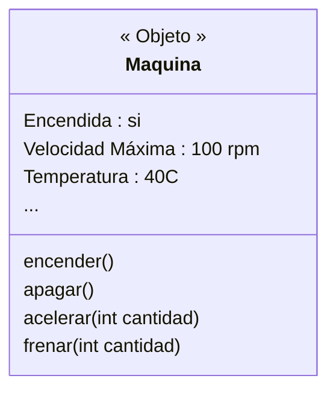

En la figura estamos modelando un objeto de la vida real en un concepto de POO. 
Lo interesante, es que en _POO TODO son clases y objetos_ (casi todo en realidad 
pero no nos pondremos tan exquisitos ahora). 

Por ejemplo, podríamos pensar en un objeto, un poco más abstracto que una máquina de una fábrica, que nos ayude a conectarnos a una API Rest. Este objeto podría tener como estado la URL a la que apunta, y como 
“comportamiento” le podamos pedir que haga un GET o un POST a esa URL.

En POO estes objeto tendría el siguiente diseño:

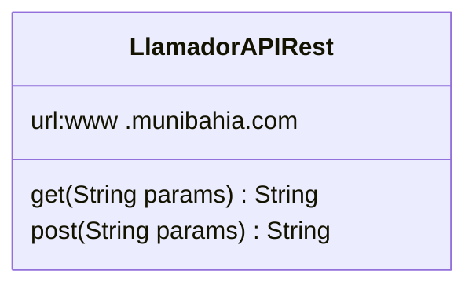

### ¿Qué es una Clase ?
Una clase es lo que contiene toda la descripción necesaria (métodos y atributos) para poder crear un objeto. 

Es decir: **para poder crear un objeto, necesitamos sí o sí la clase que describe 
cómo construir ese objeto**.

La clase nos dice para cada atributo del objeto, si es un int, un String, o si es del tipo de otro objeto. 

Para cada método nos dice si tiene parámetros de entrada, de salida y de qué tipos.
(..y también nos dice cuáles son los _“constructores”_ que aparecen más abajo)

### Introducción a UML
En UML una Clase se representa con un **RECTÁNGULO** dividido en 3 secciones:

- La sección superior tiene el **nombre de la clase** que representa
- Luego siguen los **atributos** de la clase con el sig. formato:
  - _nombreParametro :tipoDeDato_, ejemplo de atributo:
    - _nombre:String_
  
- Finalmente los métodos , con el siguiente Formato:
  - _nombreMétodo (tipodatoEntrada nombreDatoEntrada):tipoDatoSalida_, ejemplos de 
métodos: 
    - _sumarValores(Integer valor 1, Integer valor 2):Integer;_
    - caminar(Integer velocidad); ← notar que no tiene datos de salida
  
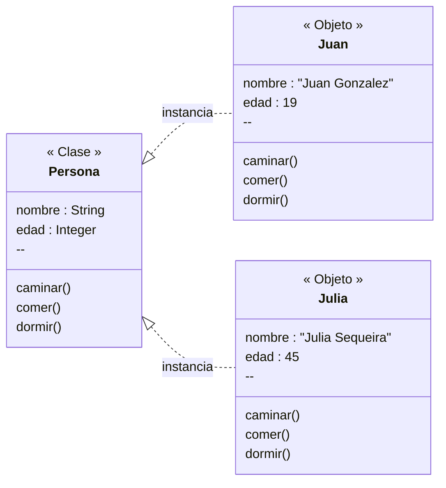

### ¡Las clases son tipos de datos!
**Una Clase es al fin y al cabo un tipo de dato** ( que tiene un estado y también se le pueden pedir cosas). 

Por lo tanto, es lo más normal ver **clases que están compuestas por otras clases, que referencian a otras clases y qué aceptan y devuelven datos del tipo de otra clase**.

Por ejemplo, supongamos la clase _"Persona"_ definida anteriormente, que tiene un nombre, una edad... y ahora queremos agregarle su **posición** en el planeta (coordenadas). Podríamos decir que **el nombre es un String** y **la edad un Integer**... pero la **“Posición”** ¿qué sería?. Ya estamos en problemas si queremos utilizar un tipo de datos simple o básico (int, float, string, etc).

Entonces podríamos pensar en crear una **clase “Posición”** que tiene los valores de latitud y longitud.

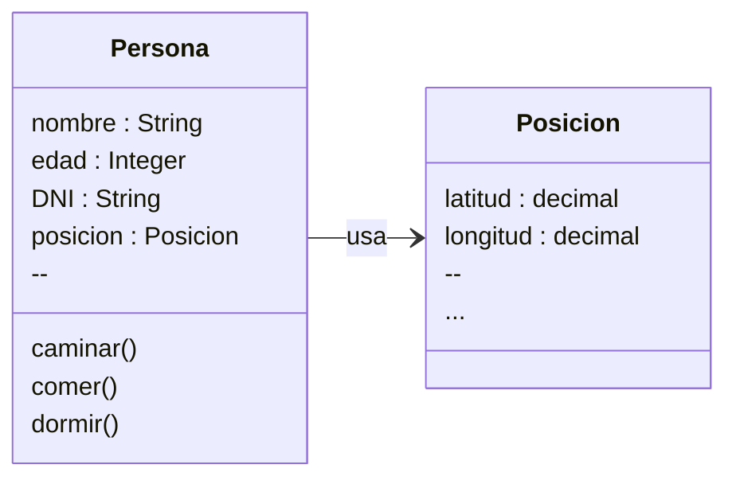

### ¿Cómo se crea una clase?
Hasta ahora vimos que una clase tiene:
- Un nombre
- Un conjunto de Atributos
- Un conjunto de Métodos. 

Nos está faltando algo que nos permita _construir_ objetos de esa Clase... y eso es lo que llamaremos _“Constructores”_.

Los constructores son **métodos especiales**, que pueden tener parámetros de entrada (o no) y cuando se invoquen devolverán un objeto del mismo tipo que la clase.

Distinguimos constructores de métodos en UML, porque el constructor se llama igual que la clase y no se indica :&lt;_tipodedato&gt; indicando tipo de dato de salida.

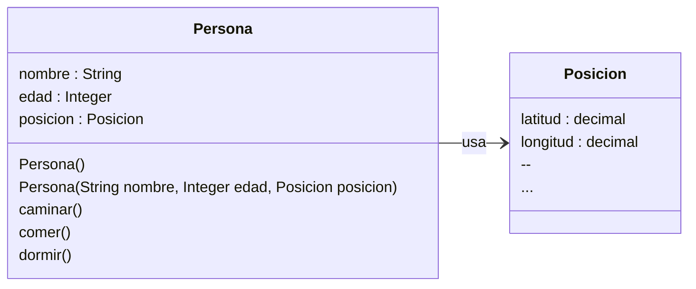
(Observar que hay dos constructores que se llaman igual)

### Tipo de dato de una consulta

Es común encontrar mientras uno desarrolla, que una clase ya declarada hace falta gregarle uno o más métodos nuevos. En este caso supongamos que queremos agregar un método llamado _"viajarA"_ que tiene como dato de entrada una **posición** en el mundo, y **nos devuelve** como dato de salida un boolean que indica si se pudo viajar a esa persona o no a esa posición.

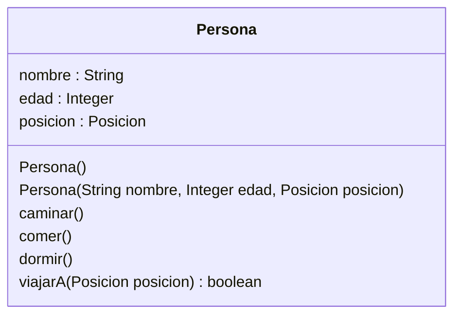
### ¿Cómo se declara una clase en Typescript?

Este código debe estar en un archivo que se llame IGUAL a la clase, sería persona.ts

```ts
// archivo: posicion.ts

// Clase Posicion (en lugar de interface)
export class Posicion {
  public x: number;
  public y: number;

  constructor(x: number, y: number) {
    this.x = x;
    this.y = y;
  }
}
```

```ts
// archivo: persona.ts

// Clase Persona
export class Persona {
  public nombre: string;
  public edad: number;
  public posicion: Posicion;

  // Constructores del UML (sobrecarga)
  constructor();
  constructor(nombre: string, edad: number, posicion: Posicion);
  constructor(nombre?: string, edad?: number, posicion?: Posicion) {
    this.nombre = nombre ?? "";
    this.edad = edad ?? 0;
    this.posicion = posicion ?? { x: 0, y: 0 };
  }

  public caminar(): void {
    // implementar comportamiento
  }

  public comer(): void {
    // implementar comportamiento
  }

  public dormir(): void {
    // implementar comportamiento
  }

  public viajarA(posicion: Posicion): boolean {
    if (!posicion) return false;
    this.posicion = posicion;
    return true;
  }
}

```

```ts
// archivo: main.ts
import { Persona } from "./persona";
import { Posicion } from "./posicion";

const posicionInicial = new Posicion(10, 20);
const juan = new Persona("Juan", 30, posicionInicial);

juan.caminar();
juan.comer();
juan.dormir();

const nuevaPosicion = new Posicion(100, 200);
const resultado = juan.viajarA(nuevaPosicion);

console.log(`¿Viaje exitoso? ${resultado}`);
console.log(`Nueva posición de Juan: (${juan.posicion.x}, ${juan.posicion.y})`);

```
### Instanciar una clase
Suponiendo que ya tenemos creado el archivo Persona.Typescript con el código de la clase dentro, ahora queremos **crear un objeto** de tipo Persona. Para crear objetos se utiliza **new** y el nombre del constructor que elijamos.

Entonces, supongamos queremos crear 2 objetos personas:

```ts
Persona juan = new Persona();
// es lo mismo que : 
Persona juan;
juan = new Persona();
```

¿Qué pasa cuando hacemos: ``` Persona juan = new Persona();``` ?

1. Se declara una variable llamada juan del tipo _Persona_.
2. Se crea un objeto en la memoria del tipo _Persona_.
3. Se llama al constructor _Persona()_.
4. La variable juan queda apuntando al objeto creado.
   
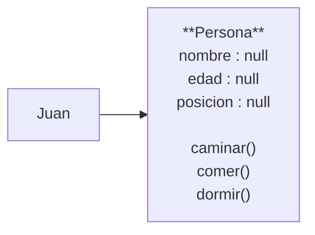
¿Qué pasa cuando hacemos: ``` Persona juan = new Persona( “Juan Gonzalez” , "23", null);``` ?

Estamos usando otro contructor, que tiene más parámetros de entrada (o tal vez, el mismo contructor pero sin los parámetros por omisión)

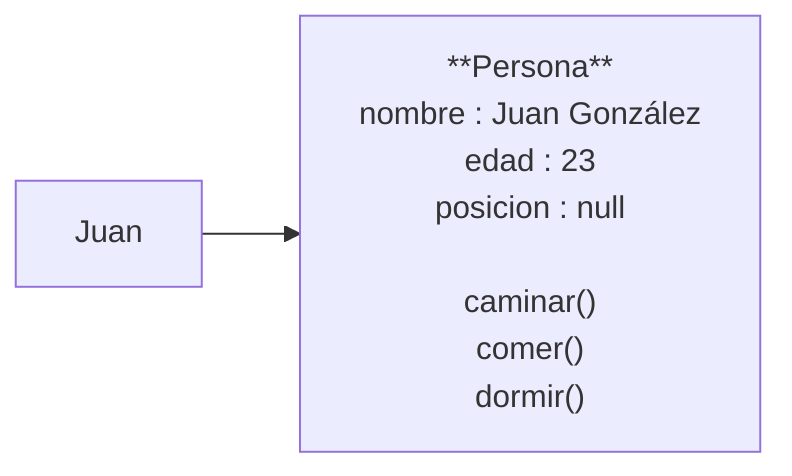
### Acceder a una clase
¿Cómo hago para acceder a los atributos y/o métodos de una clase?

En Typescript se escribe así: _&lt;nombre de la variable&gt;.&lt;nombre -método/nombre -atributo&gt;_

Por ejemplo si al objeto que apunta la variable “juan ” queremos asignarle una nueva edad:

```ts
juan.edad = 37;
```

Ejemplos de instancias:

```ts
Persona juan = new Persona( “Juan ”,null,null);
Persona pepe = new Persona( “Pepe”,null,null);
```


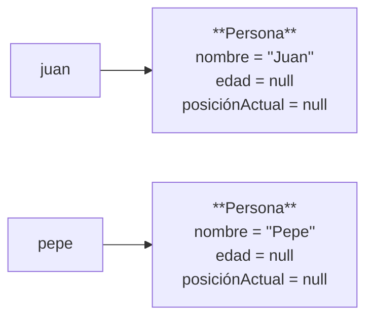

### Reasignando objetos
¿Qué pasa si asignamos el objeto Juan a Pepe con la esta instrucción?:

```ts
juan = pepe; 
```
¿Cuál sería el valor de ```juan.nombre``` ? ¿Juan o Pepe?

¿Cuál sería el valor de ```pepe.nombre```? ¿Juan o Pepe?

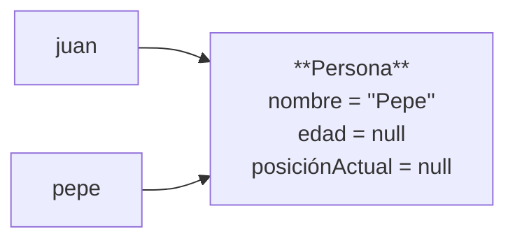


## Agregación y Composición de clases en UML

### Asociación entre objetos (o clases)

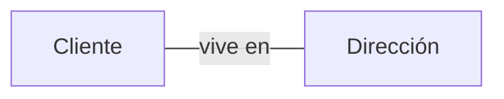

Una asociación es una relación que indica que un objeto utiliza o está vinculado con otro objeto, permitiendo la comunicación o colaboración entre ellos.

Supongamos que tenemos las clases Profesor y Curso. Una asociación podría representar que:
- Un Profesor dicta uno o varios Cursos.
- Un Curso es dictado por un Profesor.

En UML, los diagramas de asociación entre objetos se representan como:
- Si las asociaciones se pueden recorrer en ambos sentidos, se usa una línea plana. 
- Si queremos que se recorra sólo en un sentido se utiliza una flecha.

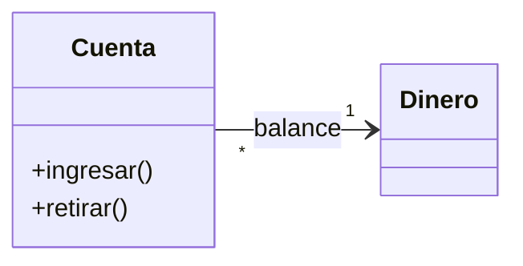
**Asociación unidireccional**
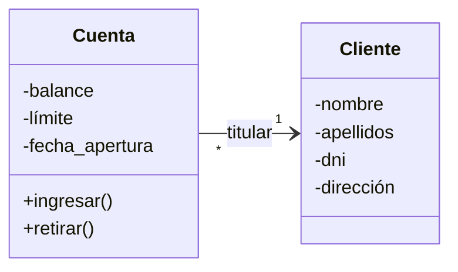

**Asociación bidireccional**

---
#### Ejemplo:


Equivale a:
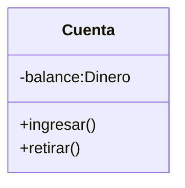
```ts
// archivo: dinero.ts

// Clase auxiliar Dinero (puedes ajustarla según necesidades reales)
export class Dinero {
  private valor: number;

  constructor(valor: number) {
    this.valor = valor;
  }

  public getValor(): number {
    return this.valor;
  }

  public sumar(cantidad: Dinero): void {
    this.valor += cantidad.getValor();
  }

  public restar(cantidad: Dinero): void {
    this.valor -= cantidad.getValor();
  }
}

```

```ts
// archivo: cuenta.ts

// Clase Cuenta
import { Dinero } from "./dinero";

export class Cuenta {
  private balance: Dinero;

  constructor() {
    this.balance = new Dinero(0);
  }

  public ingresar(cantidad: Dinero): void {
    this.balance.sumar(cantidad);
  }

  public retirar(cantidad: Dinero): void {
    this.balance.restar(cantidad);
  }

  public getSaldo(): Dinero {
    return this.balance;
  }
}

``` 

```ts
// archivo: main.ts

import { Dinero } from "./dinero";
import { Cuenta } from "./cuenta";

const cuenta = new Cuenta();
cuenta.ingresar(new Dinero(100));
cuenta.retirar(new Dinero(30));

console.log("Saldo actual:", cuenta.getSaldo().getValor()); // Saldo actual: 70

```


viene a ser lo mismo que:

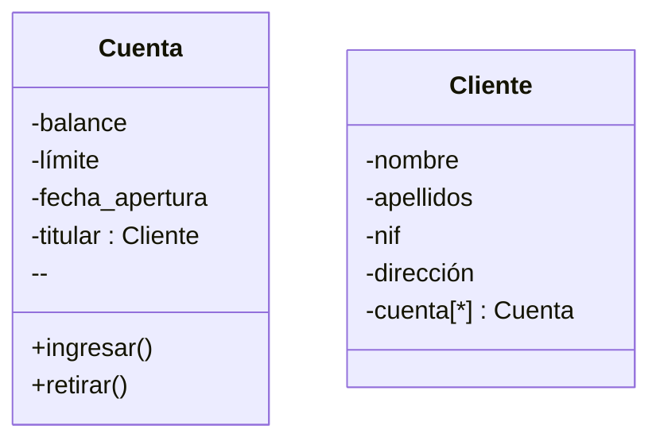
### Multiplicidad de las asociaciones


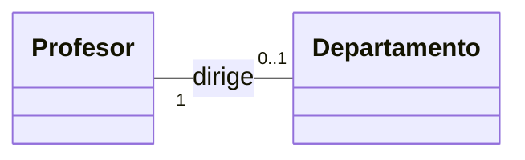
Todo departamento tiene un director.
Un profesor puede dirigir un departamento.
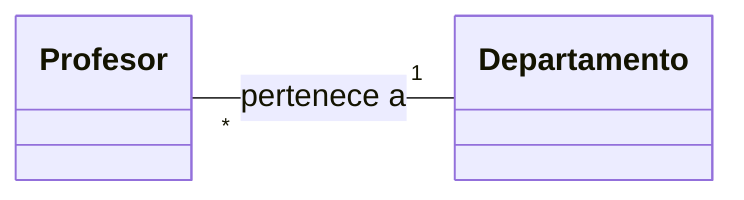
Todo profesor pertenece a un departamento. 
A un departamento pueden pertenecer varios profesores.
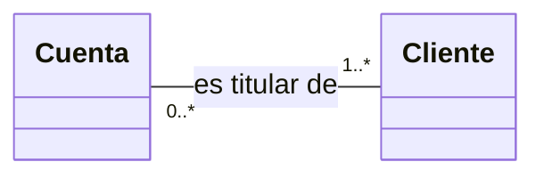
**Relación opcional**: Un cliente puede o no ser titular de una cuenta.
**Relación obligatoria**: Una cuenta ha de tener  _como mínimo_ un titular.


| Multiplicidad | Significado                     |
|---------------|---------------------------------|
| 1             | Uno y sólo uno                  |
| 0..1          | Cero o uno                      |
| N..M          | Desde N hasta M                 |
| *             | Cero o varios                   |
| 0..*          | Cero o varios                   |
| 1..*          | Uno o varios (al menos uno)     |

- Cuando la multiplicidad es 0, la relación es _opcional_.

- Una multiplicidad mayor o igual que 1 establece una _relación obligada_.

- Si no se especifica la multiplicidad, se supone que es *.

Hasta ahora vimos el caso de relaciones entre objetos más general: Asociación ,  que representa un “ tal  clase tiene relaci ón con tal otra clase.

Ahora vamos a ver *dos tipos de asociación* que son más específicos y que responden a la relación _“contiene”_:

- **Agregación**: una clase _“contiene”_  otras clases (instanciadas).
- **Composición**:  una clase A  contiene otra clase B , pero es **más 
estricta**, al punto  que  la  clase  B no  puede  existir si no  existe  la  clase A. (en este caso, se dice que la clase B  “pertenece”  a la clase A, o que, la clase B  es "parte necesaria"  de  la clase A. Si  la clase A  se destruye, también se destruye la clase B).


```svg
<svg xmlns="http://www.w3.org/2000/svg" width="400" height="400" viewBox="0 0 784 557">
  <defs>
    <style type="text/css"><![CDATA[
      .label { font-family: Arial, Helvetica, sans-serif; font-weight: 700; fill: #000000; }
    ]]></style>
  </defs>

  <!-- Background -->
  <rect x="0" y="0" width="784" height="557" fill="#ffffff"/>

  <!-- Outer ellipse: ASOCIACIÓN -->
  <ellipse cx="392" cy="280" rx="350" ry="240"
           fill="#98e6a4" fill-opacity="0.95"
           stroke="#f0a08a" stroke-width="2.5"/>
  <text class="label" x="250" y="95" font-size="44">ASOCIACIÓN</text>

  <!-- Middle ellipse: AGREGACIÓN -->
  <ellipse cx="392" cy="298" rx="285" ry="200"
           fill="#dff0df" fill-opacity="0.9"
           stroke="#f0a08a" stroke-width="2.2"/>
  <text class="label" x="250" y="195" font-size="38">AGREGACIÓN</text>

  <!-- Inner ellipse: COMPOSICIÓN -->
  <ellipse cx="392" cy="355" rx="205" ry="150"
           fill="#d7d1f3" fill-opacity="0.95"
           stroke="#f0a08a" stroke-width="2.0"/>
  <text class="label" x="250" y="340" font-size="36">COMPOSICIÓN</text>
</svg>
```
#### Ejemplos
**Agregación**
Las partes pueden formar parte de distintos agregados.

```mermaid
classDiagram
  direction LR
    class Polígono
    class Punto

    Polígono "0..1" o-- "3..*" Punto : contiene
```

Observar que los puntos pueden existir aunque no exista el polígono.
**Composición**
Agregación disjunta y estricta: Las partes solo existen asociadas al compuesto (solo se accede a ellas a través del compuesto).

```mermaid
classDiagram
    direction TB

    class Ventana 
    class Cabecera
    class Panel
    class ScrollBar

    Ventana "1" *-- "0..1" Cabecera : título
    Ventana "1" *-- "1" Panel : cuerpo
    Ventana "1" *-- "0..2" ScrollBar : barra
```

```mermaid
classDiagram
    direction TB

    class Ventana {
      -titulo : Cabecera
      -cuerpo: Panel
      -barra[2]: ScrollBar
    }
```

Si destruyo el objeto ventana, también se destruyen la cabecera, el panel  y el  ScrollBar.

La palabra _disjunta_ significa que la clase ventana no tiene elementos en común con nadie.


### Agregación vs. composición
| AGREGACIÓN | COMPOSICIÓN |
|------------|-------------|
|Relación débil entre las clases |Relación fuerte|
|Las clases pueden existir independientemente | No pueden existir independientemente |
| Una clase tiene una relación de “tiene” a otra clase | Una clase tiene la relación de “pertenece” con la otra |

Ejercicios opcionales:

1. Escribir el diagrama de clases e implementar en Typescript o pseudocódigo.
En un mundo alternativo, las personas sólo tienen un nombre (alfanumérico) y 
un apellido que consta de 5 cifras (por ejemplo 45312), a su vez pueden nacer 
con desde 1 hasta 4 ojos.
Las personas saludan diciendo: "hola, mi nombre es: " acompañado de su 
nombre y su apellido. Por ejemplo :  "hola, mi nombre es Juan 45673"
El estado les asigna una mascota a todas las personas al nacer, las mascotas 
tienen un nombre, una raza y un identificador alfanumérico.


2. Se desea modelar una fábrica de autos. La fábrica tiene un nombre y un CUIT. 
Además contiene en su interior los autos ya fabricados y también los que están en proceso de fabricación.
Los autos tienen un nombre de modeo, un color, 4 ruedas, una chapa patente que 
consta de un color y 6 caracteres y un motor que tiene una marca y una cilindrada. 
Se desea poder listar por pantalla todos los autos que están en fabricación y también todos 
los terminados. En el caso de los terminados además mostrar la marca y cilindrada del motor que tienen.

3. Escriba el diagrama de clases de estos objetos:

- Se desea representar el sistema de ventanas de la UI de un sistema operativo 
nuevo.
- Según el diseñador, las ventanas tienen un alto, un ancho, la sección de 
contenido(que siempre será un texto)  y una cabecera. 
- La cabecera tiene el título de la ventana y un botón con una cruz para cerrar la ventana.
- Al presionar la cruz se elimina completamente del sistema la ventana.

### Encapsulamiento 
Es una práctica recomendable de programación _encapsular_ (ocultar) los  atributos  
de la clase y los métodos que no queremos exponer a terceros utilizando el calificado ```private```.

NOTA: Exisite otros calificadores para modificar el acceso a un atributo: ```public``` y ```protected```, pero por ahora solo usaremos private.

Para usar encapsulamiento de atributos se debemos:

- Declarar **todos** los atributos como private
- Para cada atributo, en caso de que se necesite, debemos crear un método _get&lt;nombreAtributo&gt;_ y un método _set&lt;nombreAtributo&gt;_.
  
**get** se usa  para  obtener el valor del atributo, mientras que **set** se  utiliza  para  modificar el valor del atributo.

#### Ejemplo:
Supongamos que tenemos que escribir la clase Persona en Typescript utilizando el encapsulamiento de los atributos. Para esto,  declaramos los atributos como ```private```, y luego escribimos los _setters_ y _getters_ para cada atributo:

```ts
export class Persona {
  private nombre: string;

  constructor(nombre: string = "") {
    this.nombre = nombre;
  }

  public getNombre(): string {
    return this.nombre;
  }

  public setNombre(nombre: string): void {
    this.nombre = nombre;
  }
}
```
En UML también podemos especificar la visibilidad de cada atributo:

|Calificador|Visibilidad|
|-----|------|
|- |privado|
|+| público|
|#|protegido|
|~|paquete|

#### Ejercicios

1. Tenemos un local de almacenamiento de líquidos, ellos tienen un nombre y un ph. Si el ph es 7 se considera “neutro”, si  es menor que 7 se considera “ ácido”  y si  es mayor que 7 se considera  “alcalino”. Necesitamos  un sistema  que  nos  diga  cuántos  líquidos  de  cada  tipo  tiene  el local.

```mermaid
classDiagram
    direction LR

    class LocalAlmacenamiento {
        - nombre : string
        + imprimirReporteLiquidos()
        + LocalAlmacenamiento(nombre : String)
        + agregarLiquido(liquido : Liquido)
        + getNombre() : string
    }

    class Líquido {
        - nombre : String
        - ph : Integer
        + Liquido(nombre : string, ph : string)
        + getPh() : int
        + getNombre() : string
    }

    LocalAlmacenamiento "1" o--> "*" Líquido
```
## Herencia 
La herencia es un concepto de la POO que nos permite modelar la relación **es un** (o _es un caso más específico de_) entre las clases, permitiéndonos extender y reutilizar el código. 

Supongamos tenemos que queremos modelar un sistema para llevar registro de _Estudiantes_ y de _Empleados_.

Todos los estudiantes y empleados tienen una fecha de nacimiento y un nombre, se solicita poder calcularles la edad. 

Por otro lado, tenemos a los empleados, que tendrán un número de empleado y una cierta cantidad de dinero que ganan por hora.. Quisiéramos saber el salario mensual de cada empleado, sabiendo que se calcula como _"precio por hora * 160"_, de los estudiantes por el momento sólo nos interesa el nombre del colegio al que asisten.

En primera instancia se nos puede ocurrir algo así… 

```mermaid
classDiagram
    direction TB

    class Empleado {
        - Nombre : String
        - FechaNacimiento : Date
        - NroEmpleado : int
        - ValorHora : Decimal
        + getEdad() : int
    }

    class Estudiante {
        - Nombre : String
        - FechaNacimiento : Date
        - Colegio : String
        + getEdad() : int
        + getColegio()
    }
```
Pero vemos rápidamente que hay montones de cosas que se repiten. Violamos el principio DRY: Don't Repeat Yourself !!

Deberíamos replicar el código de ```getEdad()``` en cada clase... Algo que suena mal!


La POO nos brinda un concepto llamado Herencia, donde las clases pueden "Heredar" atributos y comportamiento de clases padres más genéricas. Si repensamos el ejemplo anterior, podríamos pensar en un clase más genérica a _Empleado_ y _Estudiante_: por ejemplo la clase PERSONA, que aunaría todo lo que es común a sus clases hijos (nombre, fecha de nacimiento, y el método de cálculo de edad).

De esta forma los atributos se declararon en **un solo lugar**, el método se escribe **una sola vez** y todos los que hereden de Persona pueden utilizarlos. 

En UML la herencia de indica con un triángulo:

```mermaid
classDiagram
  direction TB
  class Padre
  Class Hijo
  Padre <|-- Hijo
```
Ejemplo: 
```mermaid
classDiagram
    direction TB

    class Persona {
        - Nombre : String
        - FechaNacimiento : Date
        + getEdad() : int
    }

    class Empleado {
        - NroEmpleado : int
        - ValorHora : Decimal
        + getSalario() : decimal
    }

    class Estudiante {
        - Colegio : String
    }

    Persona <|-- Empleado
    Persona <|-- Estudiante
```

Podemos ver en el diagrama de arriba que las clases Hijas 
Empleados y Estudiantes, tendrán los atributos: 

- ```Nombre``` 
- ```FechaNacimiento``` 
  
Y el método:

- ```getEdad()``` 

Sin necesidad de tenerlos explícitamente declarados en su clase, ya que lo 
heredan de la clase padre. **Estaremos escribiendo el código solo una vez (en la clase Persona) y reutilizándolo 2 veces. :)**

La pregunta clave que nos tenemos que hacer para ver si estamos 
ante un posible caso de herencia es: **¿la Clase X, es un caso más 
específico de la Clase Y?**

Algunos ejemplos

- ¿La Clase _Automóvil_ es un caso específico de Clase 
_Transporte_? Como la respuesta es si, ahí podríamos tener un posible caso de 
herencia. 
- ¿La clase "Jugador de Fútbol" es un caso específico de la Clase "Deportista"?
- Etc., etc., etc.

El ejemplo de más arriba escrito en código Typescript:

```ts

// archivo: persona.ts
export class Persona {
  private nombre: string;
  private fechaNacimiento: Date;

  constructor(nombre: string, fechaNacimiento: Date) {
    this.nombre = nombre;
    this.fechaNacimiento = fechaNacimiento;
  }

  public getEdad(): number {
    const hoy = new Date();
    let edad = hoy.getFullYear() - this.fechaNacimiento.getFullYear();
    const m = hoy.getMonth() - this.fechaNacimiento.getMonth();
    if (m < 0 || (m === 0 && hoy.getDate() < this.fechaNacimiento.getDate())) {
      edad--;
    }
    return edad;
  }

  public getNombre(): string { return this.nombre; }
  public setNombre(n: string): void { this.nombre = n; }
  public getFechaNacimiento(): Date { return this.fechaNacimiento; }
  public setFechaNacimiento(f: Date): void { this.fechaNacimiento = f; }
}
```

```ts
// archivo: empleado.ts
import { Persona } from "./persona";

export class Empleado extends Persona {
  private nroEmpleado: number;
  private valorHora: number;

  constructor(
    nombre: string,
    fechaNacimiento: Date,
    nroEmpleado: number,
    valorHora: number
  ) {
    super(nombre, fechaNacimiento);
    this.nroEmpleado = nroEmpleado;
    this.valorHora = valorHora;
  }

  public getSalario(): number {
    return this.valorHora * 160;
  }

  public getNroEmpleado(): number { return this.nroEmpleado; }
  public setNroEmpleado(n: number): void { this.nroEmpleado = n; }
  public getValorHora(): number { return this.valorHora; }
  public setValorHora(v: number): void { this.valorHora = v; }
}
```

```ts
// archivo: estudiante.ts
import { Persona } from "./persona";

export class Estudiante extends Persona {
  private colegio: string;

  constructor(nombre: string, fechaNacimiento: Date, colegio: string) {
    super(nombre, fechaNacimiento);
    this.colegio = colegio;
  }

  public getColegio(): string { return this.colegio; }
  public setColegio(c: string): void { this.colegio = c; }
}
```

```ts
// main.ts (ejemplo de uso)
import { Empleado } from "./empleado";
import { Estudiante } from "./estudiante";

const emp = new Empleado("Ana", new Date(1990, 4, 12), 1234, 10.5);
console.log(emp.getSalario(), emp.getEdad());

const est = new Estudiante("Luis", new Date(2008, 10, 3), "Colegio Central");
console.log(est.getColegio(), est.getEdad());
```

#### Ejemplos 
Animales: 

- Clase base: ```Animal``` 
- Clases derivadas: ```Perro```, ```Gato```, ```Pájaro```, etc. 

Figuras geométricas: 

- Clase base: ```Figura```
- Clases derivadas: ```Círculo```, ```Cuadrado```, ```Triángulo```, etc. 

Empleados: 

- Clase base: ```Empleado``` 
- Clases derivadas: ```Gerente```, ```Desarrollador```, ```Diseñador```, etc.

Vehículos: 

- Clase base: ```Vehículo``` 
- Clases derivadas:  ```Coche```, ```Camión```, ```Motocicleta```, etc. 

Dispositivos electrónicos: 

- Clase base: ```DispositivoElectrónico``` 
- Clases derivadas: ```Teléfono```, ```Tablet```, ```Computadora```, etc. 

Productos de supermercado: 

- Clase base: ```Producto```
- Clases derivadas: ```Fruta```, ```Vegetal```, ```Lácteo```, ```Bebidas```, etc. 

Formas de pago: 

- Clase base: ```FormaDePago```
- Clases derivadas: ```TarjetaDeCrédito```, ```PayPal```, ```TransferenciaBancaria```, etc. 

Componentes de una computadora: 

- Clase base: ```Componente``` 
- Clases derivadas: ```Procesador```, ```TarjetaGráfica```, ```MemoriaRAM```, etc.

## RESUMEN DE RELACIONES 

| Si se cumple | Tipo de Relación entre clases |
|--------------|-------------------------------| 
|Clase A está relacionada con B | Asociación |
|Clase A tiene  (o contiene) clase B | Agregación | 
|Clase A tiene contiene clase B y clase B "pertenece" a la clase A (la clase B no tiene sentido de existencia si A no existe) | Composición |
|La clase B "es una" clase A (un Trabajador es una Persona, un Mamífero es un Animal, etc.) | Herencia| 
